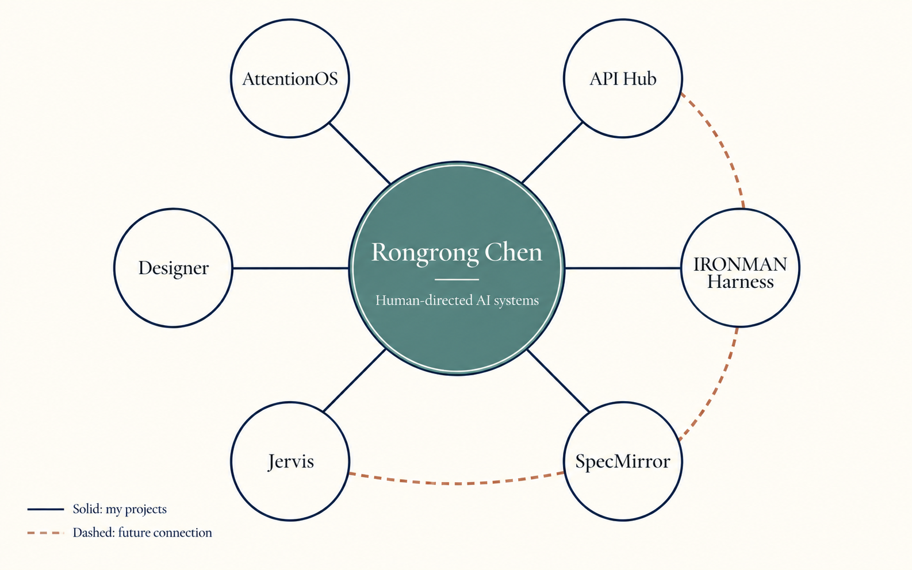

# Rongrong Chen

**Applied AI · agent systems · evidence-led product design**

M.A. Statistics, Columbia University · expected 2027

[LinkedIn](https://www.linkedin.com/in/rongrong-chen-844351305/)


> I build AI systems that make **what was observed, what was authorized, and what actually happened** inspectable.

My projects ask one larger question: **How can an AI system become useful over time without hiding its evidence or taking authority it was never given?** The three public releases below are independently runnable parts of that inquiry. They are not yet one integrated product.

[Explore the systems](#three-runnable-systems) · [Read the architecture thesis](VISION.md) · [See research notes](#research-notes)

## The direction

The future workspace I am working toward has five responsibilities. Each has a concrete project or research track behind it:

[](assets/portfolio-map.png)

*Solid spokes show my relationship to each project. Dashed links show proposed future connections between projects; they are not implemented integrations. [Open the full-size map](assets/portfolio-map.png).*

| Responsibility | Work behind it | Current boundary |
| --- | --- | --- |
| **Notice and decide** — preserve the evidence behind a decision, then compare it with later outcomes | [AttentionOS](https://github.com/Cornelius-Chen/AttentionOS) | Runnable local release; its replay does not establish predictive accuracy |
| **Grant and use capabilities** — let a caller request a scoped action without receiving provider credentials | [API Hub](https://github.com/Cornelius-Chen/API-Hub) | Runnable local MVP; live provider use requires explicit activation |
| **Execute and verify** — keep agent actions within budgets, tool scopes, and human approvals | [IRONMAN Harness](https://github.com/Cornelius-Chen/IRONMAN-Harness) | Runnable offline mission; the included model is scripted |
| **Review and learn** — separate an agent's completed run from a reusable, independently supported capability | Jervis and SpecMirror local research | Active work; a bounded Jervis evaluation did not support capability gain for one tested sample |
| **Explain and apply** — design legible interfaces and test the method in real domains | Designer, quant research, and application experiments | Separate local workstreams; no shared production runtime claimed |

The intended architecture is **evidence → scoped capability → authorized action → review → evaluated learning**. It is a design direction, not a claim that these repositories already exchange data or run as one service. [The architecture thesis](VISION.md) explains what would have to be true before calling them integrated.

## Three runnable systems

### 01 / [AttentionOS](https://github.com/Cornelius-Chen/AttentionOS) — decisions with a memory

> **Recorded example:** two locked Adopt decisions; one later Hit and one Miss. The original decision evidence stays frozen.

Public feed items or recorded replay input move through discovery, scoring, a human Adopt/Skip decision, and later outcome review. The local release includes a three-page UI, SQLite state, T0–T2 replay, tests, and a source build. Live input covers three public technology sources. [Run it and inspect the example →](https://github.com/Cornelius-Chen/AttentionOS)

### 02 / [API Hub](https://github.com/Cornelius-Chen/API-Hub) — capability access without passing around keys

```js
await hub.invoke("ai.text.generate", { prompt: "Hello" });
```

The caller names a capability. API Hub keeps the provider credential server-side and owns the grant check, route, usage record, and audit. Calls default to dry-run. The release includes a UI, gateway, Node SDK/CLI/MCP bridge, tests, and a Windows launcher build path. [Explore the local setup →](https://github.com/Cornelius-Chen/API-Hub)

### 03 / [IRONMAN Harness](https://github.com/Cornelius-Chen/IRONMAN-Harness) — agent work under human authority

> **Recorded example:** an offline Planner → Executor → Verifier mission completes with an intact event chain; a separate write action waits for one-time human approval.

The local control plane owns mission state, model routing, scoped tools, budgets, approval decisions, and audit history. Its one-command demo uses a scripted model, so it demonstrates the execution loop and approval boundary, not real-model task performance. [Run the mission →](https://github.com/Cornelius-Chen/IRONMAN-Harness)

Each repository contains its own setup instructions, architecture explanation, and verification commands.

## Research notes

- [Jervis: evidence before reusable capability](cases/jervis.md) — completed runs, useful retrieval, and capability gain require different proof.
- [Quant research: information available at decision time](cases/quant.md) — a cutoff-safe blind/reveal method with a documented negative transfer result; no live trading claim.

The public repositories contain selected runnable source and documentation. Local credentials, databases, market datasets, runtime logs, and ongoing private workspaces are outside these releases.
