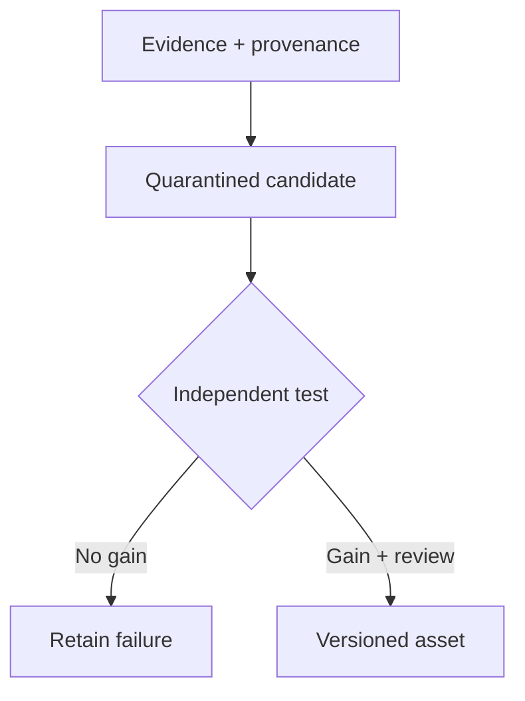
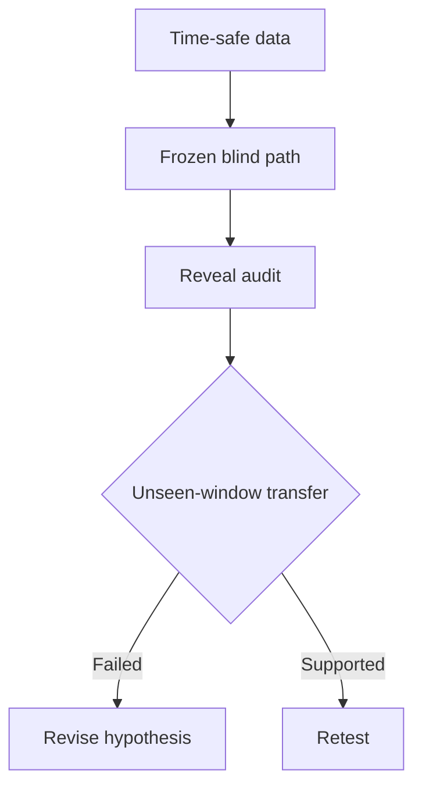

# Rongrong Chen

**Applied AI · agent workflows · data systems**

M.A. Statistics, Columbia University · expected 2027

[LinkedIn](https://www.linkedin.com/in/rongrong-chen-844351305/)

I design systems by making the question, information boundary, decision rule, and evidence for a claim visible. These notes show that reasoning through two ongoing local projects. They are design case studies, not releases of the full private workspaces.

## 01 · Jervis — when may an agent reuse what it learned?

**Question.** A successful task can leave useful traces, but task success alone does not prove that a reusable capability improved future work. How should evidence move toward a stable, reusable asset without granting the agent authority to approve its own output?

The key separation is **recorded run → useful retrieval → demonstrated capability gain**. A local blind evaluation completed, but did not support a capability-gain claim for its tested sample. The broader program remains in an active implementation phase. [Read the design decisions and current evidence →](cases/jervis.md)

## 02 · Quant — how do we learn without seeing the future?

**Question.** A backtest can look convincing when later market information slips into an earlier decision, or when a good rule is selected on the same window used to judge it. I separate the information available to a blind researcher from the information used for later diagnosis.

The first N1-to-N2 transfer challenge found that the N1 hypotheses did not transfer. That result is a reason to change the research question, not a trading-performance claim. This case describes a bounded research method; it does not represent a live trading system. [Read the method and ownership map →](cases/quant.md)

## How to read these cases

Each case follows the same path: **problem → information boundary → design choice → test → observed result → next question**. The diagrams summarize decisions; the case pages distinguish implemented local paths from design-stage components and explain what the evidence does not establish.

Only selected diagrams and design notes are published here. Local databases, credentials, market datasets, runtime logs, and the full project trees are outside this portfolio.
