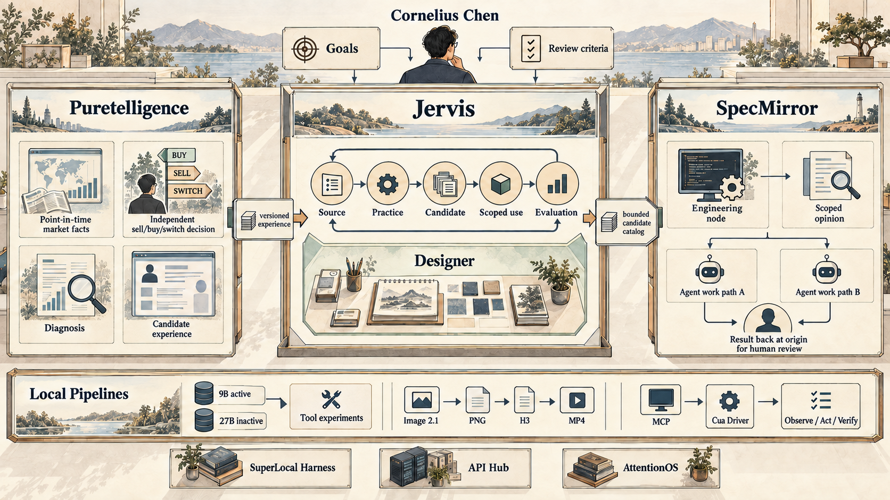
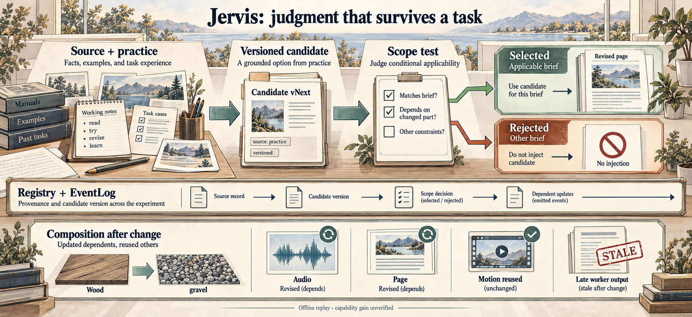
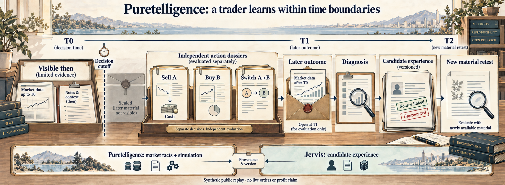
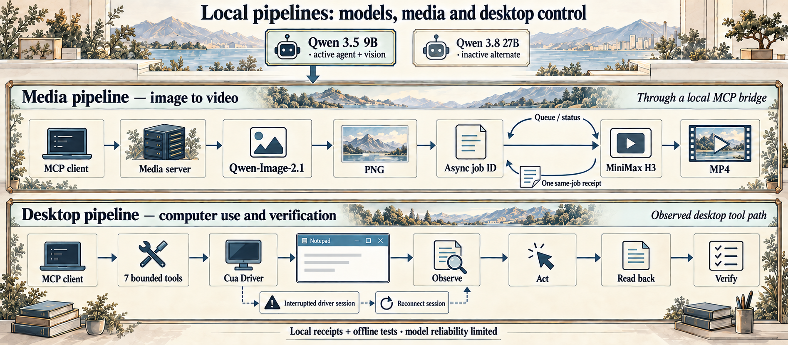

# Rongrong Chen · Cornelius

**I design AI systems that can learn from work, use tools within human authority, and show the evidence behind a result.**

M.A. Statistics, Columbia University · expected 2027 · [LinkedIn](https://www.linkedin.com/in/rongrong-chen-844351305/)

*The research studio illustration is the portfolio cover. The map below explains the project relationships.*

## The architecture I am building

Jervis is the center of this research portfolio. It asks how a model can turn examples, practice, and feedback into **scoped, reusable domain judgment**—and how a later task can test whether that judgment actually helps. I set the system goals, boundaries, and acceptance criteria; the models and tools are replaceable workers inside that design.

**Start with the research:** [Jervis learning architecture](https://github.com/Cornelius-Chen/Jervis) · [Puretelligence trader research](https://github.com/Cornelius-Chen/Puretelligence) · [SpecMirror engineering review](https://github.com/Cornelius-Chen/SpecMirror) · [system boundaries](VISION.md)

*An illustrated map of responsibility and bounded handoffs. The lower pipeline and supporting systems remain separate experiments.* [Open the full illustration](assets/portfolio-research-atlas.png) · [Inspect the editable technical map](assets/portfolio-architecture.svg) · [Read the architecture thesis](VISION.md)

| Architecture decision | Observed local behavior | Evidence limit |
| --- | --- | --- |
| **A candidate has to survive scope selection.** | Jervis reused one Designer judgment on a new brief and rejected a narrower judgment on another. | The model comparison was mixed; human quality gain remains unverified. |
| **Market facts and trader experience have different owners.** | Puretelligence's underlying Guanlan system supplied time-bounded evidence and simulation; Jervis retained candidate experience for a continuing trader identity. | Historical simulation did not establish profitable live trading. |
| **Completion and acceptance have separate records.** | SpecMirror displays scoped runs and their evidence at the engineering node. | A full human-feedback-to-learning cycle has not been demonstrated. |

### 01 · [Jervis: learning architecture](https://github.com/Cornelius-Chen/Jervis)

**Question.** Can a judgment survive one task, remain bound to its source and scope, and be evaluated on a later task? Designer is Jervis's first domain apprenticeship. Mission holds the work graph; Registry and EventLog preserve versions and transitions; replaceable workers receive bounded WorkOrders.

**Observed.** An offline replay stores one experimental Designer judgment, selects it for one fresh brief, rejects it for another, commits both pages and checks browser behavior. A separate composition run rebuilds dependent artifacts after a shared fact changes and rejects a stale worker result. Fixed synthetic responses make these reproducible mechanism tests. **Limit:** historical model comparisons were mixed; human-rated capability gain remains unverified. [Research case and source evidence →](cases/jervis.md)

### 02 · [Puretelligence: continuing-trader research](https://github.com/Cornelius-Chen/Puretelligence)

**Question.** Can a trader revise experience without leaking later outcomes into an earlier decision or collapsing selling, buying and switching into one action? Puretelligence presents the research architecture built in Guanlan. Its market system owns point-in-time facts and simulation; Jervis owns candidate experience; Lu Dongyangzi is the continuing trader identity.

**Observed.** The historical local study completed diagnostic cases, targeted study and new-material retests, leaving a candidate revision unpromoted. The public source release runs invented market paths through the original replay modules; a separate bridge checks exact Jervis Registry versions and source attachments before a fixed-action retest. **Limit:** the public fixtures do not replay the private worker, establish a blind gain, or show live fills. [Research case and evidence boundary →](cases/quant.md)

### 03 · [SpecMirror: engineering review at the source](https://github.com/Cornelius-Chen/SpecMirror)

**Question.** Can one editable project detail become scoped agent work whose exact changes return to the same node for human review? The public tests cover two segments: a feedback-to-exact-run service/UI path, and a separate dual-agent service path with isolated claims, artifacts, token deltas, review calls and persistence after restart.

**Limit:** the two paths have not been joined into one live autonomous run with a real human acceptance. [Engineering details →](https://github.com/Cornelius-Chen/SpecMirror/blob/main/docs/dual-agent-engineering.md) · [English UI evidence →](https://github.com/Cornelius-Chen/SpecMirror/blob/main/docs/review-at-origin.md)

### 04 · [Local model, media and Computer Use pipelines](https://github.com/Cornelius-Chen/Local-Pipelines)

In a separate DeepSeek Harness experiment, **Qwen 3.5 9B** is the active local agent and vision model; **Qwen 3.8 27B** is a recorded quality alternate removed from local routing. One MCP path carries a **Qwen-Image-2.1** first frame into an asynchronous **MiniMax H3** image-to-video job, with a completed same-job MP4 and receipt. Another narrows **Cua Driver** to seven bounded Computer Use tools and requires observe → act → verify. The [public source and evidence](https://github.com/Cornelius-Chen/Local-Pipelines) include both wrappers, offline contract checks, the actual media pair and a redacted deterministic Notepad run. These pipelines are not a verified Jervis backend. [Architecture and limits →](cases/local-stack.md)

### 05 · [SuperLocal Harness](https://github.com/Cornelius-Chen/SuperLocal-Harness)

A separate, runnable local mission controller owns scoped tools, budgets, human approvals, verifier steps, and event history. Its public demo uses a scripted model, so it demonstrates the control boundary rather than real-model performance. [Run the offline mission →](https://github.com/Cornelius-Chen/SuperLocal-Harness)

## Smaller runnable systems

| Repository | What it demonstrates |
| --- | --- |
| [API Hub](https://github.com/Cornelius-Chen/API-Hub) | Capability grants, provider credential custody, dry-run calls, usage, and audit in a local MVP. |
| [AttentionOS](https://github.com/Cornelius-Chen/AttentionOS) | A decision record that freezes original evidence and compares it with later outcomes. |

The public repositories contain selected source and explanations. Ongoing local research, credentials, market datasets, private feedback, and full runtime records are not included in these releases.

[Earlier relationship sketch (historical names and simplified links)](assets/portfolio-map.png)
