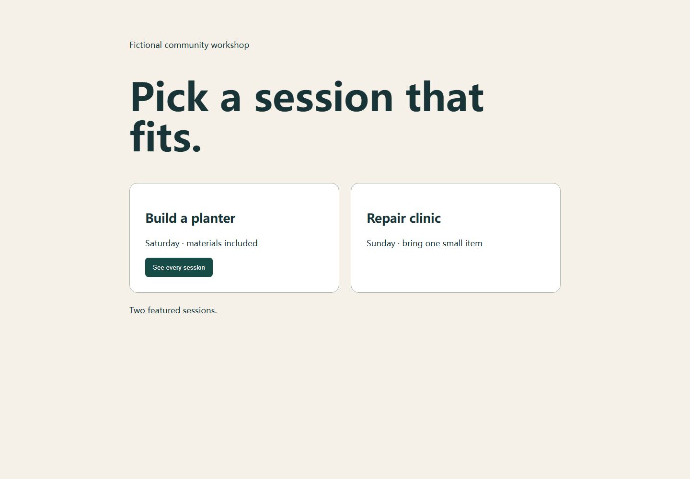
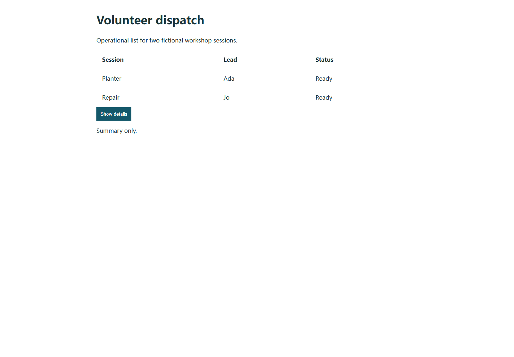

# Rongrong Chen · Cornelius

**I design AI systems that can learn from work, use tools within human authority, and show the evidence behind a result.**

M.A. Statistics, Columbia University · expected 2027 · [LinkedIn](https://www.linkedin.com/in/rongrong-chen-844351305/)

*An illustrated view of the workbench. The diagram below names the actual system boundaries and connection states.*

## The architecture I am building

Jervis is the center of this research portfolio. It asks how a model can turn examples, practice, and feedback into **scoped, reusable domain judgment**—and how a later task can test whether that judgment actually helps. I set the system goals, boundaries, and acceptance criteria; the models and tools are replaceable workers inside that design.

**Start with the work:** [run Jervis learning](https://github.com/Cornelius-Chen/Jervis) · [run Guanlan's decision replay](https://github.com/Cornelius-Chen/Guanlan-Quant) · [read the historical Designer case](cases/jervis.md#the-system-in-one-example) · [see the ownership map](VISION.md#responsibilities-and-actual-boundaries)

*Read the diagram as a map of responsibility. Solid links mark bounded local connections supported by implementation or execution records. Dashed links mark an intended handoff whose full effect is not yet demonstrated. Separate lanes are not a claim that all projects run as one platform.* [Open the full diagram](assets/portfolio-architecture.svg) · [Read the architecture thesis](VISION.md)

| Architecture decision | Observed local behavior | Evidence limit |
| --- | --- | --- |
| **A candidate has to survive scope selection.** | Jervis reused one Designer judgment on a new brief and rejected a narrower judgment on another. | The model comparison was mixed; human quality gain remains unverified. |
| **Market facts and trader experience have different owners.** | Guanlan supplied time-bounded evidence and simulation; Jervis retained candidate experience for a continuing trader identity. | Historical simulation did not establish profitable live trading. |
| **Completion and acceptance have separate records.** | SpecMirror displays scoped runs and their evidence at the engineering node. | A full human-feedback-to-learning cycle has not been demonstrated. |

### 01 · [Jervis: learning and capability composition](cases/jervis.md)

The core loop is **source → practice → conditional judgment → scoped use → evaluation**. Durable project state and source references outlive a particular model worker. Jervis selects domain capability by scope, composes work through shared entities and contracts, and preserves the distinction between a completed run, a useful retrieval, and proven capability gain.

**Designer sits inside this architecture as the first domain apprenticeship.** It originated as an independent design learning system; a bounded integration now lets Jervis use selected Designer methods and evidence for real design work. This is an integration of domain capability, not a claim that the original Designer repository was absorbed or that design quality improved in a human evaluation.

The [public Jervis repository](https://github.com/Cornelius-Chen/Jervis) contains runnable slices of the original Mission, Registry and Designer learning code. One synthetic response replay produces two complete pages: a new task uses the tentative judgment; another rejects it. A **separate composition replay** changes wood to gravel, rebuilds only the sound and its dependent artifacts, keeps the motion and note, and rejects a late worker result. Browser behavior, WAV output and persisted versions are checked. These replays are separate from the historical apprenticeship.

[Inspect the separate wood → gravel composition, including both WAV files and the stale-result receipt →](https://github.com/Cornelius-Chen/Jervis/blob/main/docs/case-composition.md)

### 02 · [Guanlan / Quant: the trader learning application](cases/quant.md)

Guanlan owns point-in-time market data, computation, historical replay, and the research simulation. **Lu Dongyangzi** is the persistent trader identity that draws on Jervis workers and versioned experience to ask questions, make research decisions, inspect outcomes, and revise candidate judgments. A local diagnostic exam → targeted study → new-material retest loop has run. It has **not** demonstrated sustained profit, strict historical blindness, or live trading authority.

The [public Guanlan research slice](https://github.com/Cornelius-Chen/Guanlan-Quant) runs selected original Q1–Q5 modules on invented data. Its four-way comparison shows why B beating cash does not justify selling A: the simulated switch trails holding A, while existing cash can buy B independently. A [second synthetic example](https://github.com/Cornelius-Chen/Guanlan-Quant/blob/main/docs/jervis-bridge.md) resolves exact Jervis Registry versions and source attachments before adding a candidate reference to a Guanlan research packet, then compares four fixed actions on another invented path. Neither example invokes the historical Jervis trader worker or measures learned trading ability.

*Synthetic prices and proxy fills only. [Run and inspect the evidence →](https://github.com/Cornelius-Chen/Guanlan-Quant)*

### 03 · [SpecMirror: inspect the work before accepting it](https://github.com/Cornelius-Chen/SpecMirror)

SpecMirror keeps the engineering graph, scoped task contracts, run evidence, and human acceptance at the original project node. Its [public source slice](https://github.com/Cornelius-Chen/SpecMirror) opens as a local workbench and includes a real service route test: a source file changes, is checked, and returns through the **exact submitted run ID** to the original opinion. The interface recording shows that review surface on an isolated project fixture; a person's production acceptance is not claimed. A limited Jervis Designer candidate catalog is connected in the local project, while feedback-to-learning remains unproven.

[Watch the isolated interface recording and inspect the source-backed loop →](https://github.com/Cornelius-Chen/SpecMirror/blob/main/docs/review-at-origin.md)

### 04 · [Local model and tool pipeline](cases/local-stack.md)

In a separate DeepSeek Harness experiment, **Qwen 3.5 9B** is the active local agent and vision model; **Qwen 3.8 27B** is recorded as a quality alternate but is removed from local routing. The media path uses MCP tools to generate an image with **Qwen-Image-2.1**, then submits an asynchronous **MiniMax H3** image-to-video job with that frame. A second MCP adapter exposes seven bounded **Computer Use** tools over Cua Driver, following observe → act → verify. These are measured local tool pipelines, not a proven Jervis backend.

### 05 · [SuperLocal Harness](https://github.com/Cornelius-Chen/SuperLocal-Harness)

A separate, runnable local mission controller owns scoped tools, budgets, human approvals, verifier steps, and event history. Its public demo uses a scripted model, so it demonstrates the control boundary rather than real-model performance. [Run the offline mission →](https://github.com/Cornelius-Chen/SuperLocal-Harness)

## Smaller runnable systems

| Repository | What it demonstrates |
| --- | --- |
| [API Hub](https://github.com/Cornelius-Chen/API-Hub) | Capability grants, provider credential custody, dry-run calls, usage, and audit in a local MVP. |
| [AttentionOS](https://github.com/Cornelius-Chen/AttentionOS) | A decision record that freezes original evidence and compares it with later outcomes. |

The public repositories contain selected source and explanations. Ongoing local research, credentials, market datasets, private feedback, and full runtime records are not included in these releases.
