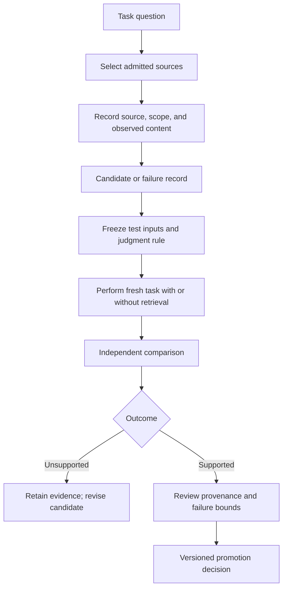

# Jervis · evidence before reusable capability

[← Portfolio overview](../README.md)

## Research question

How can an agent system accumulate useful experience while keeping a human-verifiable boundary between a recorded event, a candidate insight, and a stable capability?

The target measure is **human minutes per verified outcome**, rather than the number of agent runs. I treated the durable record and promotion decision as separate parts of the design because a run can complete without demonstrating improvement on later tasks.

## The decisions

| Pressure | Design choice | What the choice prevents |
| --- | --- | --- |
| Chat history is easy to use as memory | Keep durable state in structured records; compile context for a task | An untraceable conversation becoming the source of truth |
| A plausible lesson may be wrong elsewhere | Keep raw evidence immutable and candidate assets quarantined | Silent promotion of an attractive but untested rule |
| The producing agent has an incentive to call its result successful | Separate execution from independent evaluation and promotion authority | Self-certification of capability gain |
| More memory can make retrieval noisier | Record `applies_when`, `fails_when`, provenance, and evaluation references | A global dump that ignores task scope and failure conditions |

## Evidence path

The `Registry` and `EventLog` are shared records for the learning runtime. A new branch or experiment should not create a second, competing authority. Completion of source reading, a useful retrieval, and capability gain are three different observations.

## Current evidence ceiling

- The governed program ledger reports foundation audit complete, with the Designer structured migration phase active. Later phases are locked until their gates are met.
- A bounded local learning runtime and blind evaluation exist. For one tested sample and configuration, the independent review classified capability gain as **not supported**. That result is specific to the test; it is not a claim that learning is impossible.
- The diagram is the design logic for the system. It does not claim that every planned phase or domain is operational.

## Next research question

Which kinds of source-attributed candidate knowledge improve a fresh task enough to justify their retrieval and maintenance cost, under an independently locked evaluation?
