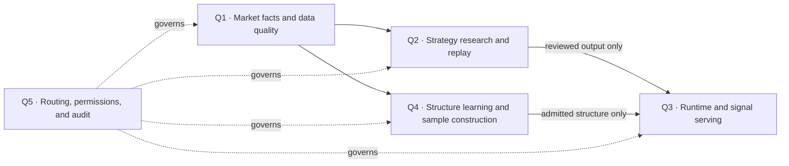

# Quant research · information available at decision time

[← Portfolio overview](../README.md)

## Research question

How can an A-share research system tell whether a rule transfers to an unseen window, rather than rewarding a rule for information it could not have known when the decision was made?

This is a research-system design case. It does not publish a strategy, recommend a trade, or claim a live execution path.

## Ownership map

Q1 owns market facts and data readiness. Q2 owns research questions and comparison. Q3 serves runtime surfaces and signals; it does not turn a research candidate into a live order. Q4 owns structure-learning assets. Q5 owns routing, permissions, and audit without taking over the other domains' business meaning.

## Blind and reveal roles

| Role | May see | Must not do |
| --- | --- | --- |
| Blind researcher | Cutoff-safe observations and the transfer package admitted before each decision | Read future outcomes or a teacher's post-window analysis |
| Opportunity solver | Full realized window for diagnostic comparison | Become the blind decision maker or a reported capability |
| Research director | Frozen path, outcome, and diagnostic landscape | Rewrite the frozen path after seeing the result |
| Reviewer | Committed artifacts and the information-boundary record | Treat a successful backtest as proof of transfer or live authority |

The point-in-time rule is `available_at <= decision_cutoff`. A blind iteration freezes one decision trajectory before reveal-side analysis. A later comparison can suggest a new representation, but that representation faces another blind challenge.

## Observed negative result

The recorded N2 transfer challenge did **not** support the N1 hypotheses. The current research status calls for a fresh N2 blind iteration and a different decision structure. A concentrated candidate replay lacks a freeze marker and is not counted as a completed iteration.

This is why the method keeps failed hypotheses and separates a research diagnostic from a strategy. The architecture of a broader Research Center has been written and frozen for review; that document is a design artifact, not evidence that every proposed worker and page is running.

## Next research question

Can a new decision structure transfer across windows without future leakage, and what observations would falsify it before any runtime or trading claim?
